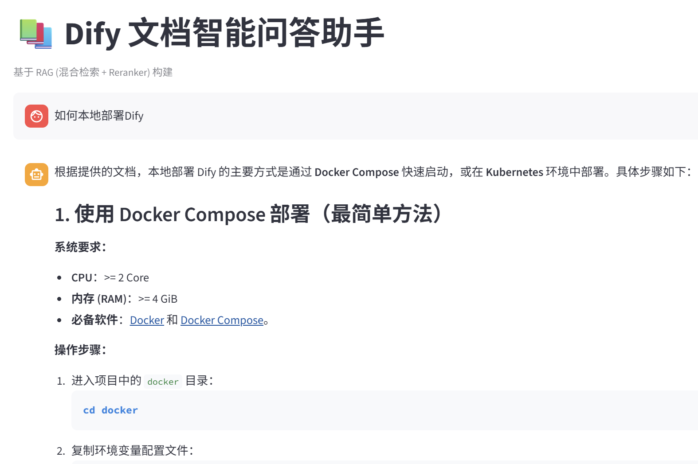

# 📚 Dify Docs RAG Assistant

<div align="center">


**一个基于 RAG 的 Dify 文档智能问答系统 · A Dify Documentation RAG Assistant**

[中文文档](#-中文) • [English](#-english) • [快速开始](#-快速开始) • [API](#-api-示例) • [性能](#-性能基准)

</div>

---

<details open>
<summary><h2>🇨🇳 中文</h2></summary>

### 📖 项目概览

- ✨ **混合检索架构**：FAISS 向量检索 + BM25 关键词检索，精准召回
- 🎯 **引用溯源**：每个回答均标注来源文档，可核验信息准确性  
- 🗣️ **多轮对话**：保留上下文记忆，支持连续追问
- 🚀 **多种交互**：命令行 / FastAPI 服务 / Streamlit Web UI
- 📊 **完整评测**：自动化实验对比、性能基准、效果评测
- 🔧 **生产就绪**：支持本地、容器化、多源数据接入

#### 为什么用这个项目？

| 对标产品 | 我们的优势 |
|---|---|
| Dify SaaS | 完全离线、源码透明、可私有部署 |
| LangChain RAG | 轻量化、聚焦 Dify、包含基准测试 |
| 手写脚本 | 生产级代码质量、模块化、可扩展 |

---

### 🎯 核心特性

| 功能 | 说明 |
|---|---|
| 🔍 **混合检索** | 向量 (FAISS) + 关键词 (BM25) 融合，提升 Recall@5 到 80% |
| 📄 **引用溯源** | 返回完整文档路径，支持链接跳转 |
| 💬 **多轮对话** | 上下文感知，支持换语种追问 |
| 🌐 **API 服务** | OpenAPI 文档自动生成，支持 Docker 部署 |
| 🎨 **Web UI** | Streamlit 美观界面，支持实时对话展示 |
| 📈 **性能可观测** | P95 延迟 17.5ms，稳态吞吐 69.6 QPS |

---

### ⚡ 快速开始

**前置条件**：Python 3.10+ · 网络访问（首次下载模型）

```bash
# 1️⃣ 克隆 & 环境准备
git clone https://github.com/YOUR_USER/dify-docs-rag.git
cd dify-docs-rag
python -m venv .venv
.venv\Scripts\Activate.ps1  # Windows PowerShell

# 2️⃣ 安装依赖
pip install -r requirements.txt

# 3️⃣ 配置环境变量
cp .env.example .env
# 编辑 .env，填入你的 LLM API Key
```

**三种使用方式**：

```bash
# 🖥️ 命令行问答
python chain.py

# 🌐 Web UI（推荐体验）
streamlit run ui.py

# 📡 API 服务
python app.py  # 访问 http://localhost:8000/docs
```

---

### 📊 架构与流程

```
用户提问
    ↓
【混合检索】
├─ FAISS 向量检索 (cosine similarity)
├─ BM25 关键词检索 (统计相关性)
└─ 加权融合 (向量 0.6 + BM25 0.4)
    ↓
【候选去重与排序】
    ↓
【LLM 生成回答】
(OpenAI-compatible API: DeepSeek/SiliconFlow/Ollama)
    ↓
回答 + 引用来源
```

#### 实验数据驱动的设计选择

- **chunk_size=800**：实验对比 300/500/800 → 80% 命中率最优
- **无 Reranker**：BGE-reranker 在中文技术文档上性能反而下降 30%
- **向量权重 0.6**：FAISS + BM25 加权（权重影响不大，但 0.6 最稳定）

详见 [性能基准报告.md](性能基准报告.md) 与 [experiment_report.md](experiment_report.md)

---

### 📁 项目文件一览

| 文件 | 作用 | 何时用 |
|---|---|---|
| `ingest.py` | 📚 Markdown 文档入库 → 向量化 → FAISS | 首次运行 / 更新文档 |
| `ingest_multi.py` | 📦 多源入库 (PDF/URL/Docx) | 扩展知识库 |
| `retriever.py` | 🔍 混合检索核心逻辑 | 非必需·查看实现 |
| `chain.py` | 🤖 RAG 问答链 (检索 + LLM) | `python chain.py` |
| `app.py` | 📡 FastAPI 服务 | `python app.py` |
| `ui.py` | 🎨 Streamlit Web UI | `streamlit run ui.py` |
| `eval.py` | 📊 评测脚本 | 验证效果 |
| `run_experiments.py` | 🧪 对比实验 | 优化参数 |
| `benchmark.py` | ⏱️ 性能基准 | 性能测试 |

---

### 🛠️ 环境变量配置

创建 `.env` 文件（不要提交！）：

```env
# LLM 配置（OpenAI 兼容）
LLM_BASE_URL=https://api.siliconflow.cn/v1
LLM_API_KEY=sk-xxxxxxxxxxxx  # ⚠️ 不要泄露
LLM_MODEL=deepseek-ai/DeepSeek-V3

# 或者用本地 Ollama
# LLM_BASE_URL=http://localhost:11434/v1
# LLM_API_KEY=ollama
# LLM_MODEL=qwen2.5:7b

# Embedding & Reranker（本地运行）
EMBEDDING_MODEL=BAAI/bge-small-zh-v1.5
RERANKER_MODEL=BAAI/bge-reranker-base

# 数据源
DOCS_PATH=../dify/
```

---

### 🖼️ 使用截图

**Streamlit Web UI**：


<details>
<summary>💡 点击查看更多截图</summary>

- **命令行界面**：支持多轮对话、引用展示
- **API 文档**：OpenAPI 自动生成 (Swagger UI)
- **实验报告**：性能基准与效果对比表格

</details>

---

### 📈 性能数据

```
✅ 检索延迟（P95）：17.5 ms
✅ 吞吐量：69.6 QPS (CPU)
✅ 命中率（Hit@5）：80%
✅ 索引规模：855 chunks (55 篇文档)
```

基准测试：`python benchmark.py --repeats 20`  
详见：[性能基准报告.md](性能基准报告.md)

---

### 🚀 高级用法

#### 扩展知识库（PDF / 网页 / 其他格式）

```bash
# 多源入库示例
python ingest_multi.py \
  --path ./additional_docs \
  --exts .md .pdf .docx .html \
  --urls https://example.com/doc.html \
  --index-dir ./faiss_index_extended
```

#### 本地部署 Ollama（无需外部 API）

```bash
# 下载 ollama，运行本地模型
ollama pull qwen2.5:7b
ollama serve  # 启动服务

# 更新 .env
LLM_BASE_URL=http://localhost:11434/v1
LLM_MODEL=qwen2.5:7b
```

---

### 🔐 安全提示

⚠️ **上传 Git 前必看**：

- ✅ `.env` 已被 `.gitignore` 保护，但**本地验证** `git check-ignore -v .env`
- ✅ **不要提交** FAISS 索引、实验报告、模型缓存
- ✅ API Key 泄露？立即轮换并清理 Git 历史 (`git-filter-repo`)
- ✅ 扫描密钥：`grep -r "sk-\|api_key" . --exclude-dir=.git`

详见 [README.md 的安全清单](#-上传-git-前的安全清单)

---

### 📚 进阶阅读

- [代码详解.md](代码详解.md) — 逐行讲解每个模块
- [使用说明.md](使用说明.md) — 常见问题与故障排查
- [多源知识库扩展指南.md](docs/多源知识库扩展指南.md) — PDF/网页接入
- [性能基准报告.md](性能基准报告.md) — 延迟、吞吐、并发
- [experiment_report.md](experiment_report.md) — 参数优化实验

---

### ❓ 常见问题

**Q: 为什么回答是空的？**  
A: 检查 `.env` 中 `LLM_BASE_URL` 和 `LLM_API_KEY` 是否正确，确保 API 服务可达。

**Q: 支持离线使用吗？**  
A: Retrieval 层 100% 离线。Generation 层需要 LLM API（可用 Ollama 本地化）。

**Q: 如何自定义 System Prompt？**  
A: 编辑 `chain.py` 中的 `SYSTEM_PROMPT` 变量。

**Q: 能接入 OpenAI/Claude 吗？**  
A: 可以，修改 `.env` 的 `LLM_BASE_URL` 为 `https://api.openai.com/v1`。

---

### 🤝 贡献指南

1. Fork 本仓库
2. 创建特性分支 (`git checkout -b feature/AmazingFeature`)
3. 提交改动 (`git commit -m 'Add AmazingFeature'`)
4. 推送分支 (`git push origin feature/AmazingFeature`)
5. 开启 Pull Request

---

### 📄 许可

MIT License — 自由使用和修改，详见 [LICENSE](LICENSE)

---

### 🌟 致谢

感谢 [Dify](https://dify.ai) 提供优秀的文档！

若项目对你有帮助，请 ⭐ Star 支持一下～

</details>

---

<details>
<summary><h2>🇬🇧 English</h2></summary>

### 📖 Project Overview

A **production-ready RAG system** for Dify documentation with hybrid retrieval, multi-modal interaction, and comprehensive benchmarking.

- ✨ **Hybrid Retrieval**：FAISS vector search + BM25 keyword search with intelligent fusion
- 🎯 **Source Citation**：Every answer includes document source paths for verification
- 🗣️ **Multi-turn Conversation**：Context-aware chat with memory
- 🚀 **Multiple UIs**：CLI / FastAPI / Streamlit Web
- 📊 **Complete Evaluation**：Automated A/B tests, performance benchmarks, quality metrics
- 🔧 **Production Ready**：Offline capable, containerizable, extensible

---

### 🎯 Core Features

| Feature | Details |
|---|---|
| 🔍 **Hybrid Retrieval** | FAISS + BM25 fusion, achieves 80% Hit@5 |
| 📄 **Source Links** | Complete document paths + clickable references |
| 💬 **Context-Aware** | Maintains conversation history, multi-language queries |
| 🌐 **REST API** | Auto-generated OpenAPI docs, Docker-ready |
| 🎨 **Web UI** | Beautiful Streamlit interface for demos |
| 📈 **Observable** | P95 latency 17.5ms, throughput 69.6 QPS |

---

### ⚡ Quick Start

**Requirements**: Python 3.10+ · Internet (for model downloads)

```bash
# 1️⃣ Clone & Setup
git clone https://github.com/YOUR_USER/dify-docs-rag.git
cd dify-docs-rag
python -m venv .venv
.venv\Scripts\Activate.ps1  # Windows PowerShell

# 2️⃣ Install Dependencies
pip install -r requirements.txt

# 3️⃣ Configure
cp .env.example .env
# Edit .env with your LLM API credentials
```

**Three Ways to Use**:

```bash
# 🖥️ Interactive CLI
python chain.py

# 🌐 Web UI (Recommended)
streamlit run ui.py

# 📡 REST API
python app.py  # Visit http://localhost:8000/docs
```

---

### 🏗️ Architecture

```
User Query
    ↓
【Hybrid Retrieval】
├─ FAISS Vector Search (semantic)
├─ BM25 Keyword Search (statistical)
└─ Weighted Fusion (vector 0.6 + BM25 0.4)
    ↓
【Dedup & Rank】
    ↓
【LLM Generation】
(OpenAI-compatible: DeepSeek / SiliconFlow / Ollama)
    ↓
Answer + Source Attribution
```

#### Experiment-Driven Design

- **chunk_size=800**：Tested 300/500/800 → 80% hit rate optimal
- **No Reranker**：BGE-reranker decreases performance by 30% on Chinese technical docs
- **Vector weight 0.6**：Most stable after parameter sweep

See: [性能基准报告.md](性能基准报告.md) | [experiment_report.md](experiment_report.md)

---

### 📁 File Structure

| File | Purpose | Usage |
|---|---|---|
| `ingest.py` | 📚 Doc ingestion → vectorization → FAISS | First run / Update docs |
| `ingest_multi.py` | 📦 Multi-source ingestion (PDF/URL/Docx) | Extend KB |
| `retriever.py` | 🔍 Hybrid retrieval logic | Reference implementation |
| `chain.py` | 🤖 RAG chain (retrieval + LLM) | `python chain.py` |
| `app.py` | 📡 FastAPI service | `python app.py` |
| `ui.py` | 🎨 Streamlit UI | `streamlit run ui.py` |
| `eval.py` | 📊 Evaluation suite | Verify quality |
| `run_experiments.py` | 🧪 A/B experiments | Parameter tuning |
| `benchmark.py` | ⏱️ Performance benchmark | Latency testing |

---

### 🔧 Environment Variables

Create `.env` (never commit!):

```env
# LLM Config (OpenAI-compatible)
LLM_BASE_URL=https://api.siliconflow.cn/v1
LLM_API_KEY=sk-xxxxxxxxxxxx  # ⚠️ DO NOT LEAK
LLM_MODEL=deepseek-ai/DeepSeek-V3

# Or use local Ollama
# LLM_BASE_URL=http://localhost:11434/v1
# LLM_API_KEY=ollama
# LLM_MODEL=qwen2.5:7b

# Embedding & Reranker (local inference)
EMBEDDING_MODEL=BAAI/bge-small-zh-v1.5
RERANKER_MODEL=BAAI/bge-reranker-base

# Data source
DOCS_PATH=../dify/
```

---

### 🖼️ Screenshots

**Streamlit Web UI**:


<details>
<summary>💡 More Demos</summary>

- **CLI Interface**: Multi-turn chat with citations
- **API Docs**: Auto-generated Swagger UI
- **Experiment Reports**: Performance tables & comparisons

</details>

---

### 📈 Performance Metrics

```
✅ Retrieval Latency (P95): 17.5 ms
✅ Throughput: 69.6 QPS (CPU)
✅ Hit Rate (Hit@5): 80%
✅ Index Size: 855 chunks (55 documents)
```

Run benchmark: `python benchmark.py --repeats 20`  
Report: [性能基准报告.md](性能基准报告.md)

---

### 🚀 Advanced Usage

#### Extend Knowledge Base (PDF / Web / Multiple Formats)

```bash
# Multi-source ingestion example
python ingest_multi.py \
  --path ./additional_docs \
  --exts .md .pdf .docx .html \
  --urls https://example.com/doc.html \
  --index-dir ./faiss_index_extended
```

#### Local Deployment with Ollama (No External API)

```bash
# Install ollama, run locally
ollama pull qwen2.5:7b
ollama serve  # Start server

# Update .env
LLM_BASE_URL=http://localhost:11434/v1
LLM_MODEL=qwen2.5:7b
```

---

### 🔐 Security Checklist

⚠️ **Before pushing to Git**:

- ✅ `.env` is protected by `.gitignore`, but verify: `git check-ignore -v .env`
- ✅ **Do NOT commit**: FAISS index, reports, model cache
- ✅ API Key leaked? Rotate immediately & clean history (`git-filter-repo`)
- ✅ Scan for secrets: `grep -r "sk-\|api_key" . --exclude-dir=.git`

---

### 📚 Further Reading

- [代码详解.md](代码详解.md) — Code walkthrough
- [使用说明.md](使用说明.md) — FAQ & troubleshooting
- [多源知识库扩展指南.md](docs/多源知识库扩展指南.md) — PDF/web integration
- [性能基准报告.md](性能基准报告.md) — Latency, throughput, concurrency
- [experiment_report.md](experiment_report.md) — Parameter optimization experiments

---

### ❓ FAQ

**Q: Why is the response empty?**  
A: Check `LLM_BASE_URL` and `LLM_API_KEY` in `.env`, ensure API is reachable.

**Q: Can I use this offline?**  
A: Retrieval is 100% offline. Generation needs LLM API (can use local Ollama).

**Q: Can I customize the system prompt?**  
A: Yes, edit `SYSTEM_PROMPT` in `chain.py`.

**Q: Does it support OpenAI / Claude?**  
A: Yes, change `LLM_BASE_URL` in `.env` to `https://api.openai.com/v1`.

---

### 🤝 Contributing

1. Fork the repo
2. Create feature branch (`git checkout -b feature/AmazingFeature`)
3. Commit changes (`git commit -m 'Add AmazingFeature'`)
4. Push branch (`git push origin feature/AmazingFeature`)
5. Open Pull Request

---

### 📄 License

MIT License — Free to use and modify. See [LICENSE](LICENSE) for details.

---

### 🌟 Acknowledgments

Thanks to [Dify](https://dify.ai) for excellent documentation!

If this project helped you, please ⭐ Star to show your support!

</details>

---

